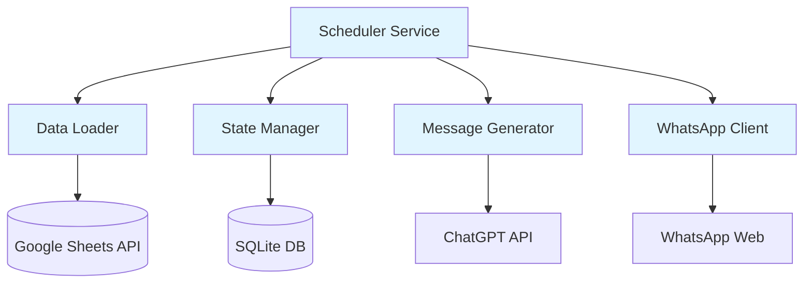

# Design Document: Automated Birthday WhatsApp Messaging System

## Overview

The Automated Birthday WhatsApp Messaging System is a Node.js-based agentic application that automatically sends personalized birthday wishes via WhatsApp. The system integrates with Google Sheets for friend data storage, uses ChatGPT for message generation, and leverages WhatsApp Business API or whatsapp-web.js for message delivery.

### Key Design Decisions

1. **WhatsApp Integration**: Use whatsapp-web.js library for WhatsApp Web protocol access, providing a simpler alternative to WhatsApp Business API without requiring business verification. This approach uses QR code authentication and maintains a persistent session.

2. **Time Zone Handling**: Use the `luxon` library for robust time zone conversions based on country names, with fallback to UTC offsets for edge cases.

3. **Persistence Layer**: Use SQLite for tracking sent messages and maintaining state across restarts, providing a lightweight embedded database solution.

4. **Scheduling Architecture**: Implement a daily scheduled task that runs once per day at 4:00 AM IST, checking all friends and sending birthday messages to those whose birthday is today in their local timezone. Friend data is refreshed every 24 hours.

5. **ChatGPT Integration**: Use OpenAI's GPT-4 API with structured prompts to generate culturally appropriate birthday messages in multiple languages.

## Architecture

### System Components



### Component Responsibilities

1. **Scheduler Service**: Main orchestrator that runs once daily at 4:00 AM IST, checking all friends for birthdays occurring today in their local timezone and coordinating message delivery.

2. **Data Loader**: Responsible for fetching and validating friend data from Google Sheets, with 24-hour refresh cycles.

3. **Message Generator**: Interfaces with ChatGPT API to generate personalized, culturally appropriate birthday messages in the recipient's mother tongue.

4. **WhatsApp Client**: Manages WhatsApp Web connection, session persistence, and message delivery with retry logic.

5. **State Manager**: Tracks sent messages in SQLite to prevent duplicates and maintain delivery history.

## Components and Interfaces

### 1. Scheduler Service

**Purpose**: Orchestrates the birthday checking and message sending workflow on a daily schedule.

**Key Functions**:
- `start()`: Initializes the scheduler to run daily at 4:00 AM IST
- `checkBirthdays()`: Evaluates all friends to determine if today is their birthday in their local timezone
- `processBirthday(friend)`: Handles the complete workflow for a single birthday event

**Dependencies**: DataLoader, MessageGenerator, WhatsAppClient, StateManager

### 2. Data Loader

**Purpose**: Fetches and validates friend data from Google Sheets.

**Interface**:
```javascript
class DataLoader {
  async loadFriends(): Promise<Friend[]>
  async refreshCache(): void
  validateFriend(record): ValidationResult
}
```

**Friend Data Structure**:
```javascript
interface Friend {
  id: string;              // Unique identifier (row number or generated)
  name: string;
  birthdate: Date;         // Parsed date object
  motherTongue: string;    // Language code (e.g., 'es', 'hi', 'fr')
  whatsappNumber: string;  // E.164 format (+1234567890)
  country: string;         // Country name for timezone lookup
  timezone: string;        // IANA timezone (e.g., 'America/New_York')
}
```

**Validation Rules**:
- Birthdate must be parseable (formats: YYYY-MM-DD, MM/DD/YYYY, DD-MM-YYYY)
- WhatsApp number must match E.164 format: `^\+[1-9]\d{1,14}$`
- Country must map to a valid timezone
- All required fields must be present

### 3. Message Generator

**Purpose**: Generates personalized birthday messages using ChatGPT.

**Interface**:
```javascript
class MessageGenerator {
  async generateMessage(friend: Friend): Promise<string>
  async retryWithBackoff(fn, maxRetries): Promise<any>
}
```

**ChatGPT Prompt Structure**:
```
Generate a warm, personal birthday message for {name} in {language}.
The message should:
- Be culturally appropriate for {language} speakers
- Be 2-3 sentences long
- Express genuine warmth and friendship
- Use natural, conversational language
- Not include emojis or special formatting
```

**Retry Logic**: Exponential backoff with 3 attempts (delays: 1s, 2s, 4s)

### 4. WhatsApp Client

**Purpose**: Manages WhatsApp connection and message delivery.

**Interface**:
```javascript
class WhatsAppClient {
  async initialize(): Promise<void>
  async sendMessage(number: string, message: string): Promise<DeliveryResult>
  async isReady(): Promise<boolean>
  async disconnect(): Promise<void>
}
```

**Session Management**:
- Store session data in `.wwebjs_auth/` directory
- Persist authentication across restarts
- Handle QR code authentication on first run
- Monitor connection status and reconnect if needed

**Delivery Result**:
```javascript
interface DeliveryResult {
  success: boolean;
  messageId?: string;
  timestamp: Date;
  error?: string;
}
```

### 5. State Manager

**Purpose**: Tracks sent messages to prevent duplicates.

**Interface**:
```javascript
class StateManager {
  async recordSentMessage(friendId: string, year: number, messageId: string): Promise<void>
  async wasMessageSent(friendId: string, year: number): Promise<boolean>
  async getDeliveryHistory(friendId: string): Promise<DeliveryRecord[]>
}
```

**SQLite Schema**:
```sql
CREATE TABLE sent_messages (
  id INTEGER PRIMARY KEY AUTOINCREMENT,
  friend_id TEXT NOT NULL,
  year INTEGER NOT NULL,
  message_id TEXT,
  message_content TEXT,
  timestamp DATETIME NOT NULL,
  delivery_status TEXT NOT NULL,
  UNIQUE(friend_id, year)
);

CREATE INDEX idx_friend_year ON sent_messages(friend_id, year);
```

## Data Models

### Friend Record (from Google Sheets)

Expected Google Sheets columns:
| Column | Description | Example |
|--------|-------------|---------|
| Name | Friend's full name | "Maria Garcia" |
| Birthdate | Date of birth | "1990-05-15" |
| Mother Tongue | Language code | "es" |
| WhatsApp Number | Phone with country code | "+34612345678" |
| Country | Country of residence | "Spain" |

### Sent Message Record (SQLite)

```javascript
interface SentMessageRecord {
  id: number;
  friendId: string;
  year: number;
  messageId: string | null;
  messageContent: string;
  timestamp: Date;
  deliveryStatus: 'sent' | 'failed' | 'pending';
}
```

### Birthday Event

```javascript
interface BirthdayEvent {
  friend: Friend;
  localTime: DateTime;  // Luxon DateTime object
  shouldSend: boolean;
}
```

## Correctness Properties

*A property is a characteristic or behavior that should hold true across all valid executions of a system—essentially, a formal statement about what the system should do. Properties serve as the bridge between human-readable specifications and machine-verifiable correctness guarantees.*


### Property 1: Friend data reading completeness

*For any* valid Google Sheet with friend records, reading the sheet should return all records with all required fields (birthdate, mother tongue, WhatsApp number, country of residence) populated.

**Validates: Requirements 1.2**

### Property 2: Validation error logging for incomplete records

*For any* friend record missing one or more required fields, the validation process should fail and log an error for that specific record.

**Validates: Requirements 1.3**

### Property 3: Date format validation

*For any* string representing a date, the birthdate validator should correctly accept valid date formats (YYYY-MM-DD, MM/DD/YYYY, DD-MM-YYYY) and reject invalid formats.

**Validates: Requirements 1.4**

### Property 4: E.164 phone number validation

*For any* string, the WhatsApp number validator should correctly identify whether it matches E.164 format (^\+[1-9]\d{1,14}$).

**Validates: Requirements 1.5**

### Property 5: Timezone conversion correctness

*For any* recognized country name and UTC timestamp, the timezone converter should correctly determine the local time in that country's timezone.

**Validates: Requirements 2.1, 2.4**

### Property 6: Birthday detection for today in local timezone

*For any* friend with a birthdate and current date, the birthday detection logic should correctly identify when today is their birthday in their local timezone (matching month and day).

**Validates: Requirements 2.2**

### Property 7: Message generation in target language

*For any* friend with a specified mother tongue, the message generator should call the ChatGPT API with the correct language parameter and return a message.

**Validates: Requirements 3.1**

### Property 8: Friend name inclusion in messages

*For any* generated birthday message and friend name, the message content should contain the friend's name.

**Validates: Requirements 3.2**

### Property 9: ChatGPT API retry with exponential backoff

*For any* ChatGPT API error, the message generator should retry up to 3 times with exponential backoff delays (1s, 2s, 4s).

**Validates: Requirements 3.4**

### Property 10: Message delivery attempt

*For any* birthday message and valid WhatsApp number, the WhatsApp client should attempt to send the message and return a delivery result indicating success or failure.

**Validates: Requirements 4.1, 4.2**

### Property 11: WhatsApp delivery retry logic

*For any* WhatsApp delivery failure, the client should retry up to 3 times with 5-minute intervals between attempts.

**Validates: Requirements 4.3**

### Property 12: Sent message persistence

*For any* sent birthday message, the state manager should record the message with friend identifier, year, timestamp, and delivery status in the database.

**Validates: Requirements 4.5, 5.1**

### Property 13: Duplicate message detection

*For any* friend and calendar year, the state manager should correctly determine whether a birthday message was already sent to that friend in that year.

**Validates: Requirements 5.2**

### Property 14: Duplicate message prevention

*For any* friend with an existing message record for the current calendar year, the system should skip sending another message and not create a duplicate record.

**Validates: Requirements 5.3**

### Property 15: Persistence across restarts

*For any* sent message record, after recording it and simulating a system restart (reconnecting to database), the record should still exist and be retrievable.

**Validates: Requirements 5.4, 8.4**

### Property 16: Credential loading from environment

*For any* required credential (Google OAuth, ChatGPT API key, WhatsApp auth), the system should load it from environment variables and not from hardcoded values.

**Validates: Requirements 6.4**

### Property 17: Authentication failure handling

*For any* authentication failure (Google Sheets, ChatGPT, or WhatsApp), the system should log the error with service name and halt execution.

**Validates: Requirements 6.5**

### Property 18: Error log structure

*For any* error that occurs, the logged error should contain timestamp, component name, and error details.

**Validates: Requirements 7.1**

### Property 19: Success delivery logging

*For any* successful message delivery, a log entry should exist containing the friend identifier and timestamp.

**Validates: Requirements 7.2**

### Property 20: Birthday event logging

*For any* detected birthday event, a log entry should exist indicating the event was detected by the Scheduler.

**Validates: Requirements 7.3**

### Property 21: Critical error notifications

*For any* critical error (all retries exhausted, authentication failure), the system should send a notification to the user.

**Validates: Requirements 7.4**

## Error Handling

### Error Categories

1. **Authentication Errors** (Critical - Halt Execution)
   - Google Sheets OAuth failure
   - ChatGPT API key invalid
   - WhatsApp authentication failure
   - Action: Log error, send notification, halt execution

2. **Data Validation Errors** (Non-Critical - Skip Record)
   - Invalid birthdate format
   - Invalid phone number format
   - Missing required fields
   - Unrecognized country/timezone
   - Action: Log error, skip friend record, continue processing

3. **API Errors** (Retryable)
   - ChatGPT API timeout or rate limit
   - WhatsApp delivery failure
   - Google Sheets read failure
   - Action: Retry with exponential backoff, log attempts, notify on final failure

4. **State Management Errors** (Critical - Halt Execution)
   - SQLite database connection failure
   - Database write failure
   - Action: Log error, send notification, halt execution

### Retry Strategies

**ChatGPT API Retry**:
- Max attempts: 3
- Backoff: Exponential (1s, 2s, 4s)
- Retryable errors: Timeout, rate limit, 5xx errors
- Non-retryable: Invalid API key, 4xx errors (except rate limit)

**WhatsApp Delivery Retry**:
- Max attempts: 3
- Backoff: Fixed 5-minute intervals
- Retryable errors: Network timeout, temporary connection loss
- Non-retryable: Invalid phone number, blocked contact

**Google Sheets Retry**:
- Max attempts: 3
- Backoff: Exponential (2s, 4s, 8s)
- Retryable errors: Timeout, rate limit
- Non-retryable: Invalid credentials, permission denied

### Error Notification

Critical errors trigger user notifications via:
- Console error output (stderr)
- Optional: Email notification (if configured)
- Optional: Webhook notification (if configured)

Notification includes:
- Error timestamp
- Component name
- Error type
- Error message
- Affected friend (if applicable)

## Testing Strategy

### Dual Testing Approach

The system will use both unit tests and property-based tests to ensure comprehensive coverage:

**Unit Tests**: Focus on specific examples, edge cases, and integration points
- Specific date format examples (valid and invalid)
- Specific phone number examples (valid and invalid)
- Mock API responses for success and failure scenarios
- Database initialization and connection handling
- WhatsApp session management
- Specific timezone conversions (e.g., US, India, Spain)

**Property-Based Tests**: Verify universal properties across randomized inputs
- Use `fast-check` library for JavaScript property-based testing
- Each property test runs minimum 100 iterations
- Generate random friend data, dates, phone numbers, and error scenarios
- Validate properties hold across all generated inputs

### Property-Based Testing Configuration

**Library**: fast-check (npm package)

**Test Structure**:
```javascript
import fc from 'fast-check';

// Example property test
test('Property 4: E.164 phone number validation', () => {
  // Feature: birthday-whatsapp-messenger, Property 4: For any string, the WhatsApp number validator should correctly identify whether it matches E.164 format
  
  fc.assert(
    fc.property(
      fc.string(),
      (phoneNumber) => {
        const isValid = validateE164(phoneNumber);
        const matchesPattern = /^\+[1-9]\d{1,14}$/.test(phoneNumber);
        return isValid === matchesPattern;
      }
    ),
    { numRuns: 100 }
  );
});
```

**Test Coverage**:
- Each of the 21 correctness properties will have a corresponding property-based test
- Each test tagged with: `Feature: birthday-whatsapp-messenger, Property {N}: {property text}`
- Minimum 100 iterations per property test
- Random data generators for: friends, dates, phone numbers, countries, messages, errors

### Integration Testing

**End-to-End Scenarios**:
1. Complete birthday flow: Load data → Detect birthday → Generate message → Send message → Record delivery
2. Duplicate prevention: Send message → Restart system → Attempt to send again → Verify skipped
3. Error recovery: Simulate API failure → Verify retry → Verify final failure handling
4. Data refresh: Load initial data → Update sheet → Wait 24 hours → Verify new data loaded

**Mock Services**:
- Mock Google Sheets API responses
- Mock ChatGPT API responses
- Mock WhatsApp client (avoid actual message sending in tests)
- Use in-memory SQLite for test isolation

### Test Environment

**Dependencies**:
- Jest or Vitest for test runner
- fast-check for property-based testing
- Sinon or Jest mocks for API mocking
- SQLite in-memory mode for database tests

**Test Data**:
- Sample Google Sheets with various friend records
- Valid and invalid date formats
- Valid and invalid phone numbers
- Multiple timezones and countries
- Various language codes

### Continuous Testing

- Run unit tests on every commit
- Run property-based tests in CI/CD pipeline
- Run integration tests before deployment
- Monitor test execution time (property tests may be slower due to 100+ iterations)

